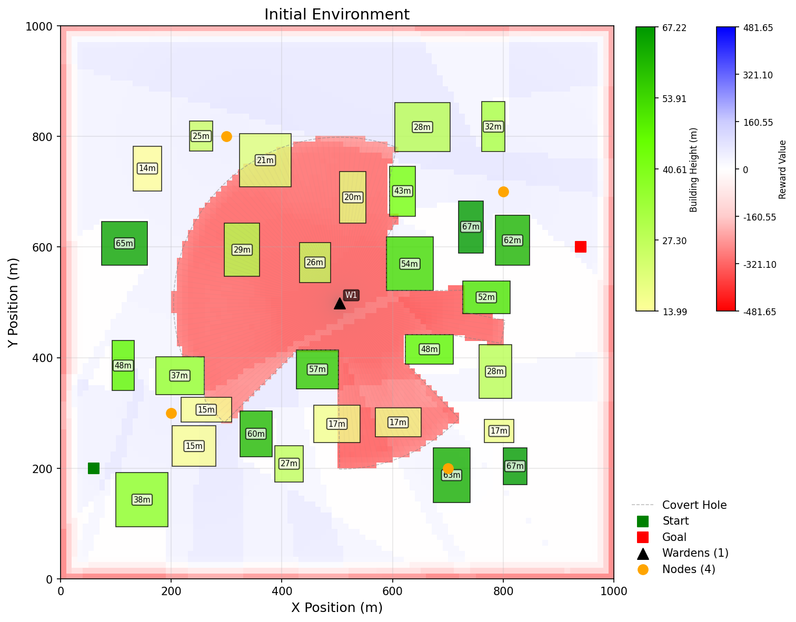
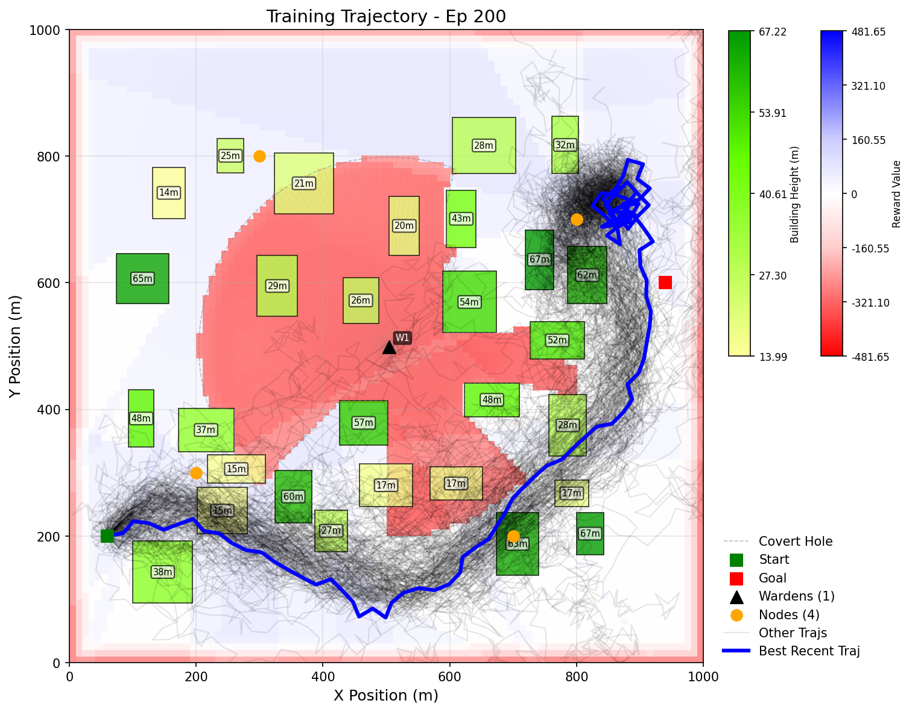
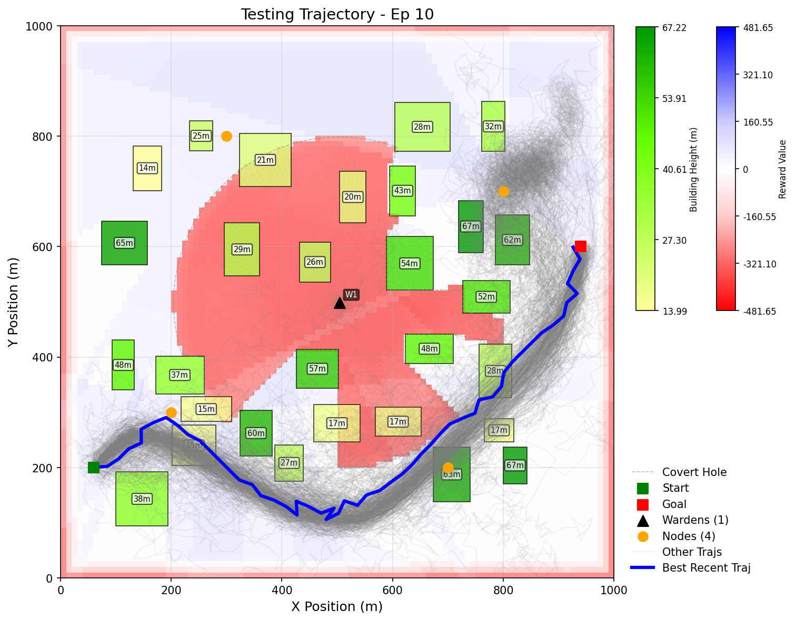
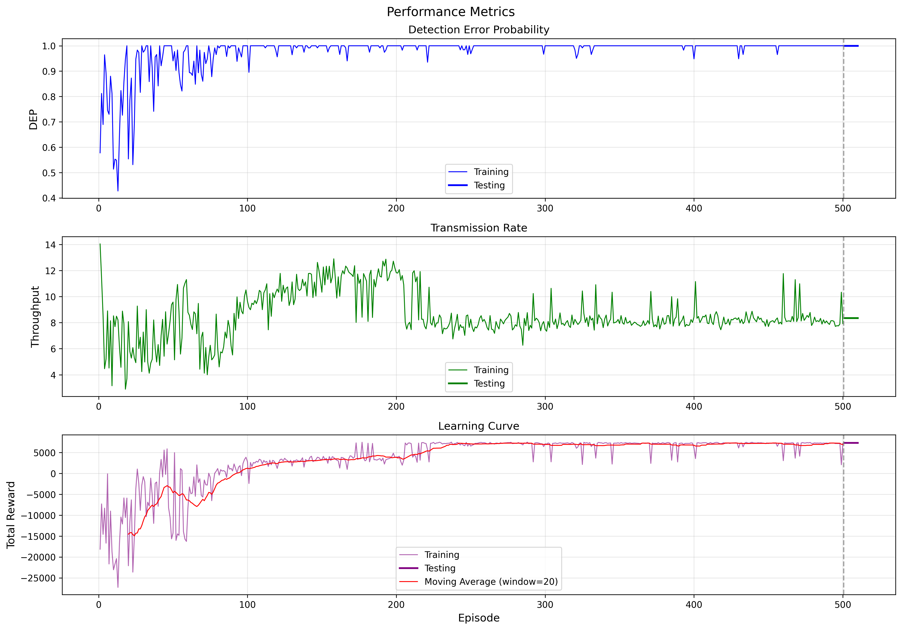

## Silent-Wing: 
## DRL-Enabled Resource Coordination for Covertness-Aware and Energy-Efficient UAV-Aided IoT

## 寂静之翼：
## 基于强化学习的资源协调，在无人机辅助物联网中兼顾隐蔽通信和能效

---

## Project Introduction
This project is a research project based on Deep Reinforcement Learning (DRL), aiming to solve the resource coordination problem in UAV-Aided IoT scenarios, with a special focus on balancing covert communication and energy efficiency. It implements a DRL-based framework to explore and validate the feasibility and effectiveness of UAV trajectory optimization in complex communication environments.

### Main Features
- **TD3-based Trajectory Optimization**:
  The core of the project uses the Twin Delayed Deep Deterministic Policy Gradient (TD3) algorithm, an advanced DRL algorithm suitable for continuous action spaces, to optimize the UAV's flight trajectory.
- **Complex Environment Modeling**:
  The project constructs a simulation environment that includes dynamically generated buildings, legitimate communication nodes, and potential eavesdroppers (Wardens). This environment simulates realistic urban or complex terrains, providing near-real-world challenges for UAV path planning.
- **Trade-off between Covert Communication and Transmission Efficiency**:
  The project balances two core objectives through a carefully designed reward function:
    - **Covertness**: Maximizing the Detection Error Probability (DEP) to make it difficult for the UAV to be detected by eavesdroppers while performing its mission.
    - **Transmission Efficiency**: Maximizing the data transmission rate by optimizing the channel quality between the UAV and legitimate ground nodes.
- **Advanced Reinforcement Learning Techniques**:
  To improve learning efficiency and algorithm performance, the project integrates several advanced techniques:
    - **Prioritized Experience Replay (PER)**: Accelerates the learning process by prioritizing the sampling of important experience data.
    - **Multi-step Learning**: More accurately evaluates the long-term value of current decisions by considering rewards from multiple future steps.
- **Detailed Visualization and Logging**:
  The project provides rich visualization tools that can dynamically display the UAV's training process, flight trajectory, environmental layout, and reward function heatmap. A detailed logging system records key performance indicators during training and testing, such as rewards, DEP, and throughput, and can generate performance curve graphs for easy analysis and evaluation.

## 项目简介
本项目是一个基于深度强化学习（DRL）的开源项目，旨在解决无人机辅助物联网（UAV-Aided IoT）场景中的资源协调问题，特别是在隐蔽通信和能源效率之间寻求平衡。项目实现了一个基于深度强化学习的框架，用于探索和验证在复杂通信环境中无人机轨迹优化的可行性与有效性。

### 主要功能
- **基于TD3的轨迹优化**:
  项目核心采用 Twin Delayed Deep Deterministic Policy Gradient (TD3) 算法，这是一个适用于连续动作空间的DRL算法，用于优化无人机的飞行轨迹。
- **复杂的环境建模**:
  项目构建了一个包含动态生成建筑物、合法通信节点和潜在窃听者（Warden）的仿真环境。该环境能够模拟真实的城市或复杂地形，为无人机路径规划提供接近现实的挑战。
- **隐蔽通信与传输效率的权衡**:
  项目通过精心设计的奖励函数来平衡两个核心目标：
    - **隐蔽性**: 通过最大化检测误差概率（DEP），使无人机在执行任务时难以被窃听者发现。
    - **传输效率**: 通过优化无人机与地面合法节点之间的信道质量，最大化数据传输速率。
- **改进的强化学习技术**:
  为了提升学习效率和算法性能，项目中集成了：
    - **优先经验回放 (PER)**: 通过优先采样重要的经验数据，加速学习过程。
    - **多步学习 (Multi-step Learning)**: 通过考虑未来多步的奖励，更准确地评估当前决策的长期价值。
- **详细的可视化与日志记录**:
  项目提供了丰富的可视化工具，能够动态展示无人机的训练过程、飞行轨迹、环境布局以及奖励函数的热力图。同时，详细的日志系统记录了训练和测试过程中的关键性能指标，如奖励、DEP、吞吐量等，并能生成性能曲线图，便于分析和评估算法效果。

---

## Quick Start Guide
### Environment Setup
1. Create a virtual environment
   ```
   python -m venv .venv
   ```
2. Activate the virtual environment
   - macOS/Linux:
     ```
     source .venv/bin/activate
     ```
   - Windows:
     ```
     .venv\Scripts\activate
     ```
3. Install project dependencies
   ```
   pip install -r requirements.txt
   ```
### Run the Project
```
python main.py
```

## 快速启动指南
### 配置环境
1. 创建虚拟环境
   ```
   python -m venv .venv
   ```
2. 激活虚拟环境
   - macOS/Linux：
     ```
     source .venv/bin/activate
     ```
   - Windows：
     ```
     .venv\Scripts\activate
     ```
3. 快速安装项目依赖
   ```
   pip install -r requirements.txt
   ```
### 运行项目
```
python main.py
```

---

## Code Structure
- `main.py`: Main program entry point
- `agent.py`: TD3 algorithm implementation
- `env.py`: Map environment
- `uav.py`: UAV and its interaction with the environment
- `log.py`: Logging
- `visual.py`: Visualization
- `figures/`: For storing visualization images
- `log/`: For storing log files

## 代码结构
- `main.py`: 主程序入口
- `agent.py`: TD3算法实现
- `env.py`: 地图环境
- `uav.py`: 无人机及其与环境的交互
- `log.py`: 日志
- `visual.py`: 可视化
- `figures/`: 用于存放可视化图像
- `log/`: 用于存放日志文件

---

## A Common Run Process

1. Run the main program
   ```
   python main.py
   ```
2. Generate the initial environment map `initial_env.png`
   
3. Start training, generating a training trajectory map every 50 epochs, e.g., `train_traj_ep_200.png`
   
4. After training is complete, run 10 test rounds and generate a test trajectory map `test_traj_ep_10.png`
   
5. Simultaneously save log files and the performance metrics graph `performance_metrics.png`
   

## 一次常见的运行过程

1. 运行主程序
   ```
   python main.py
   ```
2. 生成初始环境图 `initial_env.png`
   
3. 开始训练，每50轮生成一张训练路径图 `train_traj_ep_200.png`
   
4. 训练完成后，进行10轮测试，生成一张测试路径图 `test_traj_ep_10.png`
   
5. 同时保存日志文件与性能指标图 `performance_metrics.png`
   
